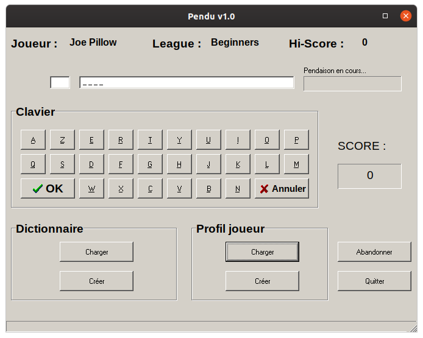
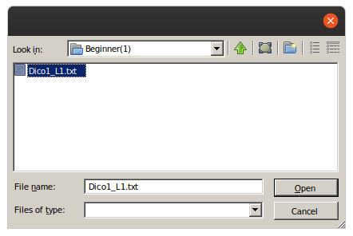

# Hangman
On the 26th of January 2000 I handed the 3.5 inches floppy drive containing this game to my Computer Science teacher. I had spent the past week with my nose stuck to my Windows 98 PC, working with my own registered copy of Delphi, an Object Pascal IDE for Wintel platforms. I got an A.
# Presentation
## What this game is about
Hangman is a word guessing game for one player. First the computer picks a word from a dictionnary, then the player tries to guess it by suggesting letters within a certain number of guesses.
## The background story (translated from French)
In 2045, the colonists from the Retzian Galactic Force settled on a small planet named *Cutrock* due to the high number of canyons covering its surface. Studies carried on the minerals located in the southern hemisphere brought the following conclusion: "Perfect conditions for industrial-scale mining - GO for 5 automated mining units and 60 EM/CFPL class miners".

A call for tenders procedure was started which ended up in two companies being selected to mine the huge amount of resources available: *SENSHEM Corporation* and *BITMAP BROS Ltd* were given *carte blanche* to bring back home as much as possible.

For several years, until 2048, everything went perfectly fine. But around mid-January 2049, the 2 companies started lurking on each other's piece of the cake, leading to an open conflict that caused the death of 5 people.

In order to avoid further escalation of an embarassing situation, United Nations decided to organize a competition that would leave the winner in total control of *Cutrock*. *SENSHEM Corporation* and *BITMAP BROS Ltd* both had to select one of their employees to compete in a Hangman game tournament. The first one to reach Gods League would win.

Today is the 18th of March 2049 and you are the lucky one chosen by *SENSHEM Corporation* to get *BITMAP BROS Ltd* out of business forever. Be strong, good luck !
## Language
The game is in French, perfect to get ready for your next visit to Paris.
## Preview

# How to run the game
## On Windows
Just run *TME's Hangman.exe* [^1], it should be fine even with Windows 10 (the game was written during the Windows 98 / 2000 era).
## On Linux
Wine is probably the best option to safely experience *Hangman* on Linux:
`wine TME\'s\ Hangman.exe`
# How to play the game
1. Load a dictionnary file (*Dictionnaire | Charger*). There are 4 difficulty levels (*Beginner*, *Knight*, *King*, *God*), I suggest you start with something easy,
2. You now have 10 tries to guess a word picked by the computer,
3. If you succeed, you have to guess the next word from the dictionnary and so on.

[^1]: I was already nicknamed TME in 2000; that name dates back from 1998 and was chosen mostly because these 3 letters looked nice in high score tables. The number 520 (and sometimes 1040) is a later addition from around 2004 and is a reference to the almighty Atari 520STe. Now you're truly a (wo)man of culture.